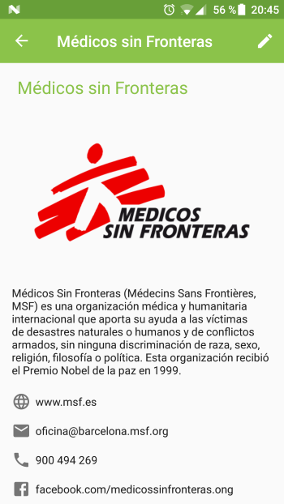
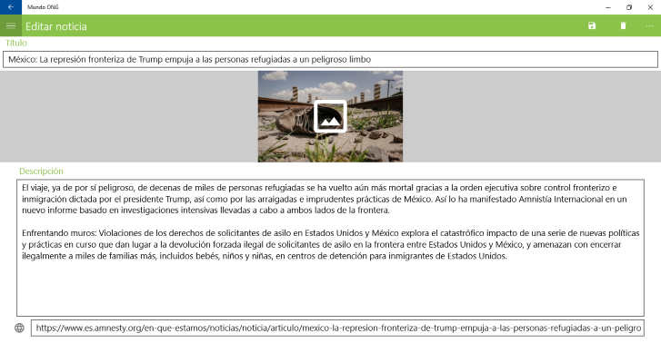

# Mundo ONG   

Xamarin Forms application submitted to apps4good contest (organized by Microsoft and CampusMVP) (https://www.campusmvp.es/concurso-xamarin.htm).

CampusMVP Xamarin online course has been my first approach to Mobile development and Xamarin in particular.

Mundo ONG (NGO World) provides a way for people to access information about NGOs (contact info, website, social media) and its announcements (news, statements, events, campaigns).
NGO responsibles may ask for a user account in order to manage all the information and announcements about their organization.
Only registered users are able to create and edit content.
Anonymous users can read all the information supplied by the NGO responsibles.
The application UI is only in spanish language for now.

The application uses:
- Azure Active Directory to manage authentication
- Azure Notification Hubs to manage push notifications (only for android and UWP so far as I don't have an apple developer account)
- Azure SQL Server and Blobs for storage
- SQLite for offline sync
- Azure Job for cleanup purposes (not for images yet)
- Various Xamarin plugins:
  - Xam.Plugin.Media
  - Xam.Plugin.Connectivity
  - Xam.Plugins.Messaging
  - Xam.Plugins.Settings
  - Plugin.Permissions
  - Plugin.Share
  - Xamarin.FFImageLoading.Forms
  - ThriveGmbH.BottomNavigationBar.XF

## Android
 
  
## iOS
  
## UWP

I've been inspired mainly by:
- CampusMVP Xamarin free course. There's a more complete paid version: https://www.campusmvp.es/catalogo/Product-Desarrollo-de-aplicaciones-m%C3%B3viles-nativas-multiplataforma-con-C-y-Xamarin_160.aspx
- Adrian Hall book: https://github.com/adrianhall/develop-mobile-apps-with-csharp-and-azure
- Various posts by James Montemagno, Adam Pedley and Javier Suárez

## What's next?
- Add organization-announcement vinculation and navigation - (halfway there)
- Bindable picker to select available organizations for a user when creating an announcement
- Add Date field for announcements (events) and possibility to add to calendar
- Add location field for announcements and organizations and open with default maps application
- Add Azure B2C so all users can register
- Manage permissions by using Azure AD groups
